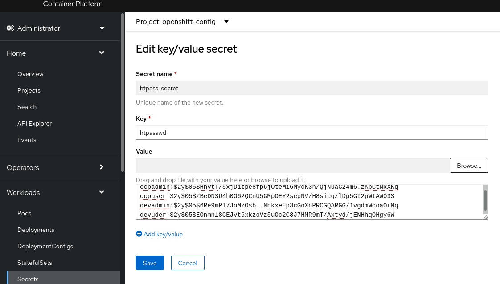
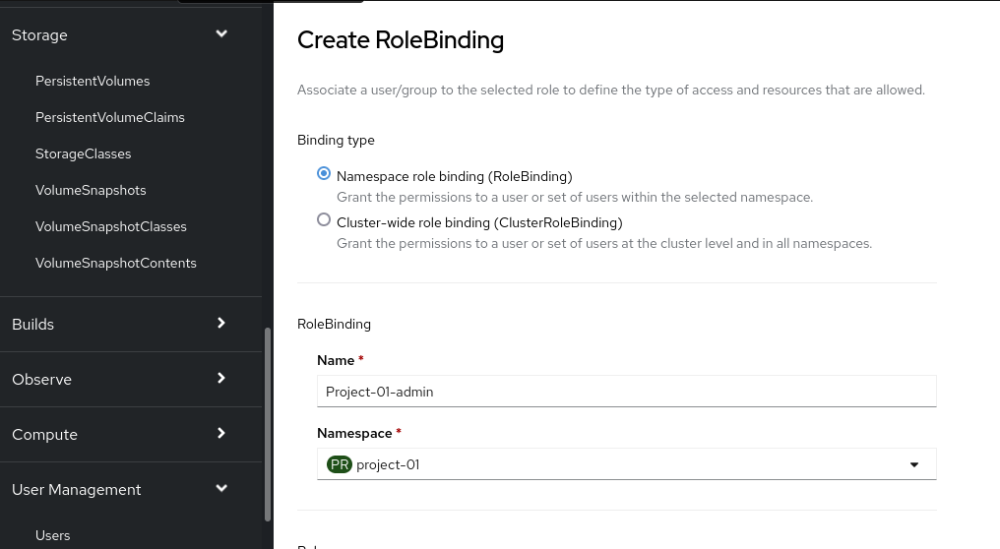
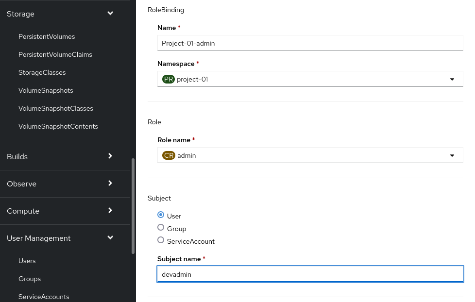
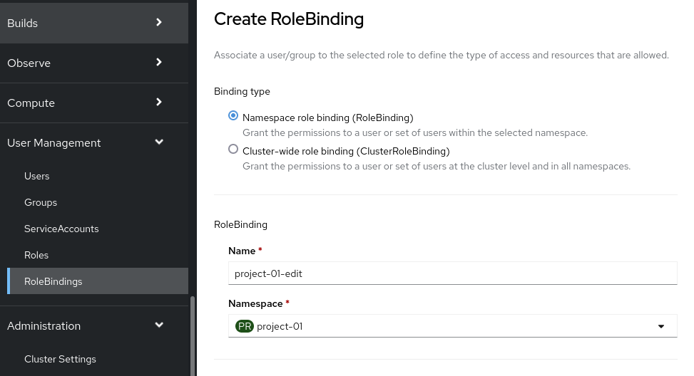
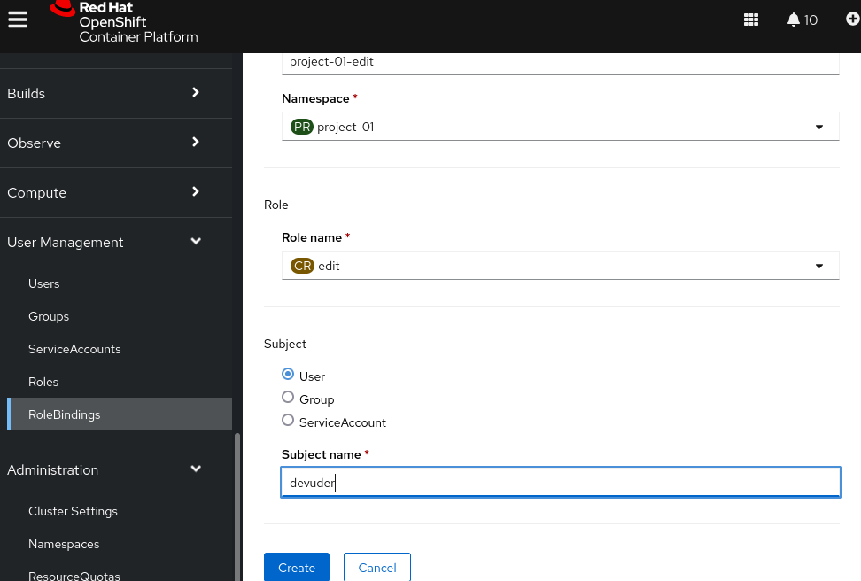

# ocp-RBAC

```
echo "# ocp-RBAC" >> README.md
git init
git add README.md
git commit -m "first commit"
git branch -M main
git remote add origin https://github.com/alpha-wolf-jin/ocp-RBAC.git
git config --global credential.helper 'cache --timeout 7200'
git push -u origin main

git add . ; git commit -a -m "update README" ; git push -u origin main
```

**OCP environemnt**
```
$ oc get clusterversion
NAME      VERSION   AVAILABLE   PROGRESSING   SINCE   STATUS
version   4.10.11   True        False         47h     Cluster version is 4.10.11

$ oc get node
NAME                        STATUS   ROLES    AGE    VERSION
aro-pcnpf-master-0          Ready    master   2d1h   v1.23.5+9ce5071
aro-pcnpf-master-1          Ready    master   2d1h   v1.23.5+9ce5071
aro-pcnpf-master-2          Ready    master   2d1h   v1.23.5+9ce5071
aro-pcnpf-worker-eastus-1   Ready    worker   47h    v1.23.5+9ce5071
aro-pcnpf-worker-eastus-2   Ready    worker   47h    v1.23.5+9ce5071
aro-pcnpf-worker-eastus-3   Ready    worker   47h    v1.23.5+9ce5071

```

# Create htpasswd Authentication

## Initate httpwd
```
$ sudo yum provides "*/htpasswd"
httpd-tools-2.4.37-47.module+el8.6.0+15654+427eba2e.2.x86_64 : Tools for use with the Apache HTTP Server
Repo        : rhel-8-for-x86_64-appstream-eus-rhui-rpms
Matched from:
Filename    : /usr/bin/htpasswd

$ sudo yum install httpd-tools -y

$ htpasswd -c -B -b ./users.htpasswd ocpadmin redhat
Adding password for user ocpadmin

$ htpasswd -B -b ./users.htpasswd ocpuser redhat
Adding password for user ocpuser

$ cat ./users.htpasswd
ocpadmin:$2y$05$HnvtT/5xjD1tpe8fp6jOteMi6MycK3n/QjNuaG24m6.zKbGtNxXKq
ocpuser:$2y$05$ZBeDNSU4h0O62QCnU5GMpOEY2sepNV/H8sieqzlDp5GI2pWIAW03S

$ oc create secret generic htpass-secret --from-file=htpasswd=/home/jin/users.htpasswd -n openshift-config

$ vim htpasswd-cr.yaml
apiVersion: config.openshift.io/v1
kind: OAuth
metadata:
  name: cluster
spec:
  identityProviders:
  - name: htpasswd_provider
    mappingMethod: claim
    type: HTPasswd
    htpasswd:
      fileData:
        name: htpass-secret

$ oc apply -f ./htpasswd-cr.yaml 

$ oc get pod -n openshift-authentication
NAME                               READY   STATUS    RESTARTS   AGE
oauth-openshift-7948f876f9-554t7   1/1     Running   0          110s
oauth-openshift-7948f876f9-x5wd5   1/1     Running   0          50s
oauth-openshift-7948f876f9-znvmk   1/1     Running   0          80s

$ oc login -u ocpadmin -p redhat
Login successful.

$ oc whoami
ocpadmin

```

**The ocpadmin htpasswd users was also given the cluster-admin role within the cluster**
```
$ oc adm policy add-cluster-role-to-user cluster-admin ocpadmin

```

# Removing self-provisioner

https://access.redhat.com/solutions/4040541

```
$ oc adm policy remove-cluster-role-from-group self-provisioner system:authenticated system:authenticated:oauth

$ oc describe clusterrolebinding.rbac self-provisioners
Error from server (NotFound): clusterrolebindings.rbac.authorization.k8s.io "self-provisioners" not found

```

**Verify self-provisioners only for cluster admin**
```
$ oc whoami
ocpadmin

$ oc new-project test

$ oc delete project test

$ oc login -u ocpuser -p redhat

$ oc whoami
ocpuser

$ oc new-project test
Error from server (Forbidden): You may not request a new project via this API.

$ oc login -u ocpadmin -p redhat

```

# Add http user

```
$ htpasswd -B -b ./users.htpasswd devadmin redhat

$ htpasswd -B -b ./users.htpasswd devuder redhat

$ cat ./users.htpasswd
ocpadmin:$2y$05$HnvtT/5xjD1tpe8fp6jOteMi6MycK3n/QjNuaG24m6.zKbGtNxXKq
ocpuser:$2y$05$ZBeDNSU4h0O62QCnU5GMpOEY2sepNV/H8sieqzlDp5GI2pWIAW03S
devadmin:$2y$05$6Re9mPI7JoMzOsb..NbkxeEp3cGoXnPRCGQARGG/1vgdmWcoaOrMq
devuder:$2y$05$EOnmnl8GEJvt6xkzoVz5uOc2C8J7HMR9mT/Axtyd/jENHhqOHgy6W

```

# Lable Taint node

```
$ oc get node
NAME                        STATUS   ROLES    AGE    VERSION
aro-pcnpf-master-0          Ready    master   2d2h   v1.23.5+9ce5071
aro-pcnpf-master-1          Ready    master   2d2h   v1.23.5+9ce5071
aro-pcnpf-master-2          Ready    master   2d2h   v1.23.5+9ce5071
aro-pcnpf-worker-eastus-1   Ready    worker   2d     v1.23.5+9ce5071
aro-pcnpf-worker-eastus-2   Ready    worker   2d     v1.23.5+9ce5071
aro-pcnpf-worker-eastus-3   Ready    worker   2d     v1.23.5+9ce5071

$ oc label node aro-pcnpf-worker-eastus-3 dev="true"

$ oc adm taint node aro-pcnpf-worker-eastus-3 dev="true":NoSchedule

$ oc describe node aro-pcnpf-worker-eastus-3
Name:               aro-pcnpf-worker-eastus-3
Roles:              worker
Labels:             beta.kubernetes.io/arch=amd64
                    dev=true
...
Taints:             dev=true:NoSchedule
...

```

# Create Project with node-selector & Tolerations

```
$ oc whoami --show-console
https://console-openshift-console.apps.aro.example.opentlc.com

$ oc whoami
ocpadmin

$ cat project.yaml 
kind: Project
apiVersion: project.openshift.io/v1
metadata:
  name: project-01
  annotations:
    openshift.io/node-selector: 'dev=true'
    scheduler.alpha.kubernetes.io/defaultTolerations: >-
      [{"operator": "Equal", "effect": "NoSchedule", "key":
              "dev", "value": "true"}
      ]

$ oc apply -f project.yaml 

```

# Operate from We UI to add Httppwd users

Select `openshift config` project

Click `Secrets` under `Workloads`

Edit secret 'httpass-secret`


**Verify newly adding users**
```
$ oc login -u devuder -p redhat

$ oc login -u devadmin -p redhat
```

**Assgine Project Admin role**

Click `RoleBindlings` under `User Management` in left window

Click `Create binding` button





**Assgine Project edit role**

Click `RoleBindlings` under `User Management` in left window

Click `Create binding` button






**Verify project eidt user can deploy POD on right node**
```
$ oc whoami
devadmin

$ oc project
Using project "project-01" on server "https://api.aro.example.opentlc.com:6443".

$ oc new-project project-02
Error from server (Forbidden): You may not request a new project via this API.

$ oc login -u devuder -p redhat

Login successful.

You have one project on this server: "project-01"

Using project "project-01".

$ echo hello-world-01 >index-01.html

$ oc create configmap index-html --from-file=index.html=./index-01.html

$ vim deploy-http.yaml 
apiVersion: apps/v1
kind: Deployment
metadata:
  labels:
    app: web
    app.kubernetes.io/component: web
    app.kubernetes.io/instance: web
  name: web
spec:
  replicas: 1
  selector:
    matchLabels:
      deployment: web
  template:
    metadata:
      labels:
        deployment: web
    spec:
      containers:
      - image: registry.redhat.io/rhel8/httpd-24:1-161.1638356842
        name: web
        ports:
        - containerPort: 8080
          protocol: TCP
        - containerPort: 8443
          protocol: TCP
        resources: {}
        volumeMounts:
        - name: index-html
          mountPath: /var/www/html/index.html
          readOnly: true
          subPath: index.html
      volumes:
      - configMap:
          defaultMode: 420
          items:
          - key: index.html
            path: index.html
          name: index-html
        name: index-html


$ oc apply -f ./deploy-http.yaml 

$ oc get pod -o wide
NAME                   READY   STATUS    RESTARTS   AGE   IP            NODE                        NOMINATED NODE   READINESS GATES
web-68667fc959-xmjj4   1/1     Running   0          60s   10.128.2.39   aro-pcnpf-worker-eastus-3   <none>           <none>


```
